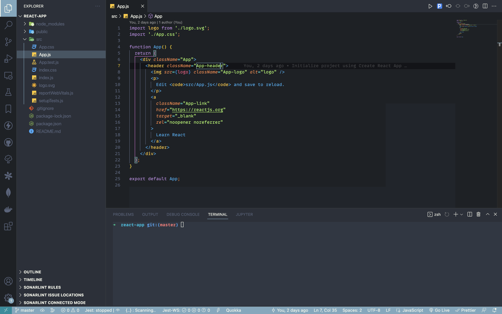
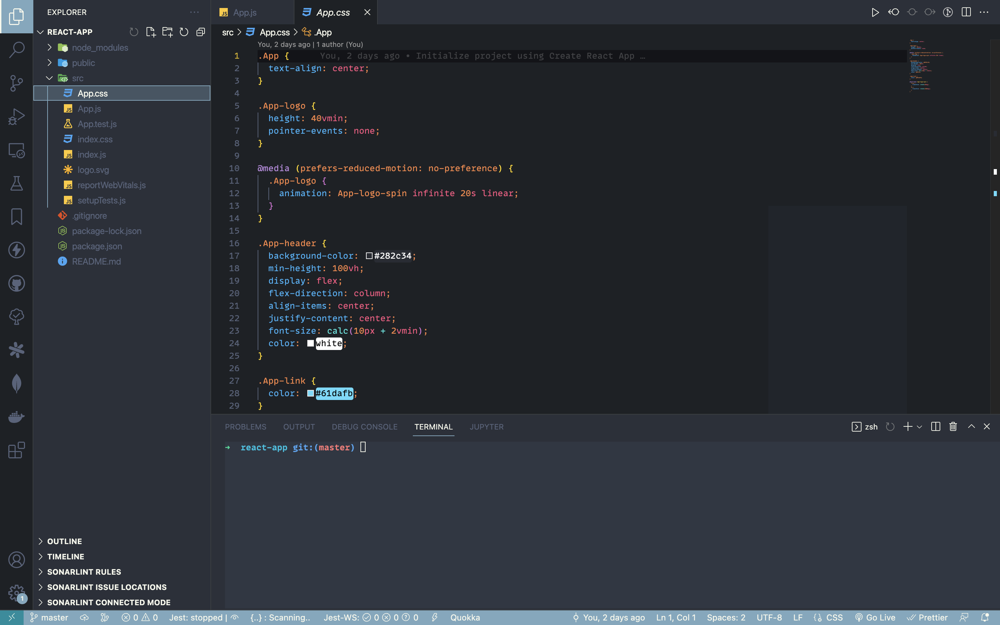

    

<h1 align="center">Leviosa Theme</h1>

An elegant theme for Visual Studio Code

## Screenshoots

    

    

## Installation

1. Open **Extensions** sidebar panel in VS Code. `View → Extensions`
2. Search for `Leviosa Theme`
3. Click **Install** to install it
4. Code > Preferences > Color Theme > **Leviosa Theme**

## Contribute

1. Fork and open this [repo](https://github.com/slatchma/leviosa-theme) in VS Code
2. Go to the debug sidebar `View → Debug`
3. Hit the green arrow beside "Launch Extension" - opens a new window
4. Make a change, and then hit the refresh button on your debug toolbar - this is in your first editor - not the one that popped open.
    - **UI**: For all changes to the "outer UI", like (status bar, file navigation etc.), take a look at the [Theme Color](https://code.visualstudio.com/api/references/theme-color) reference.
    - **Syntax**: For changes to the "code highlighting", examine the syntax scopes by invoking the [`Developer: Inspect Editor Tokens and Scopes`](https://code.visualstudio.com/api/language-extensions/syntax-highlight-guide#scope-inspector) command from the Command Palette in the Extension Development Host window.
5. Wait a sec, your changes should now be reflected!
6. Commit your changes to your fork of this repo
7. Send a PR that contains detailed information about your change (please give me a screenshot of before/after)

## Credits

[@slatchma](https://github.com/slatchma)

**Enjoy!**
